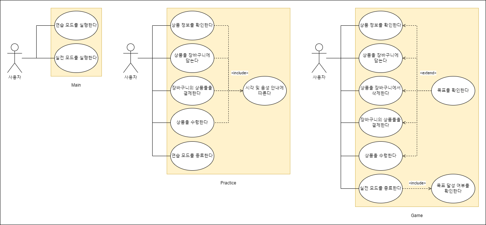
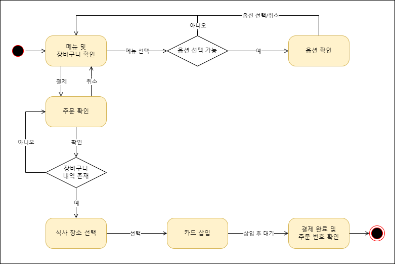
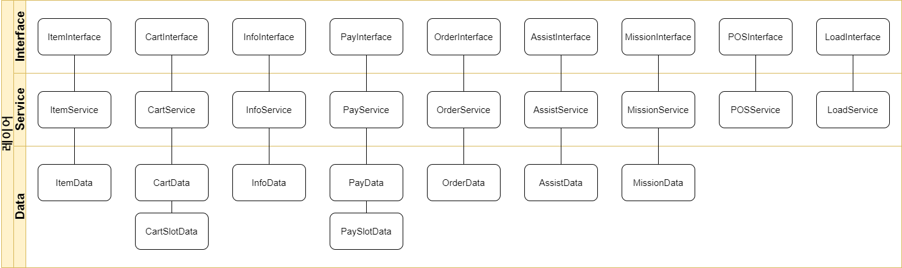
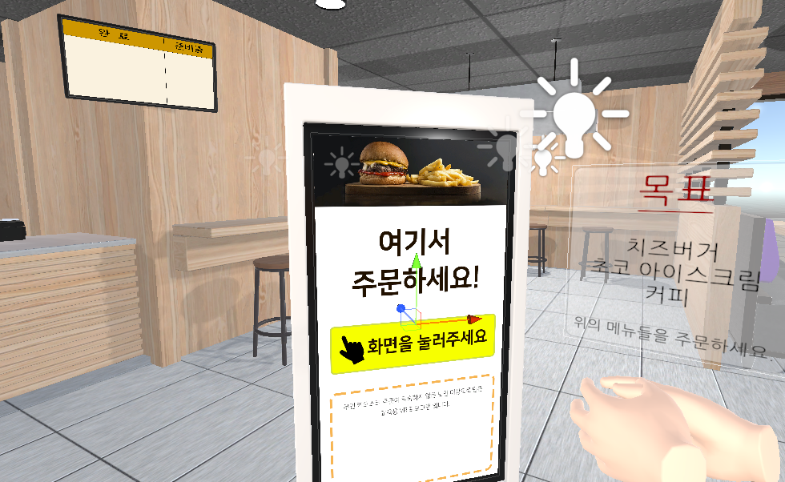
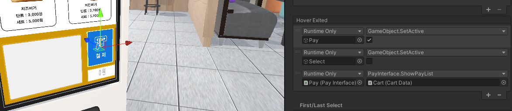
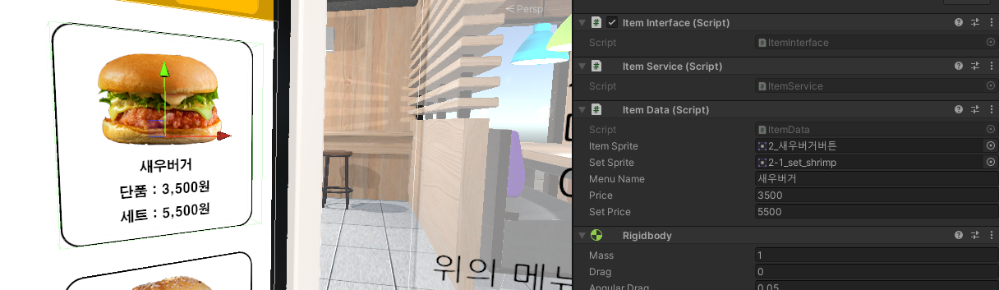

# 개발자 매뉴얼

## 목차
1. [개요](#1-개요)
2. [요구사항 및 설치](#2-요구사항-및-설치)
3. [소프트웨어 아키텍처](#3-소프트웨어-아키텍처)
4. [인터페이스 구현](#4-인터페이스-구현)
   
## 1. 개요
본 프로젝트는 한양대학교 ERICA 캠퍼스 설강 '가상및증강현실프로그래밍' 강의의 팀 프로젝트로서 진행되었으며, 노인을 위한 VR 키오스크 교육 시뮬레이션을 표방하고 있습니다. **평가를 위해 각 스크립트의 상단에는 코드에 기여한 팀원들의 정보가 기재되어 있습니다. 아래는 요약입니다.** 

요약
Item, Cart, Info : 진명인, 이현준 Mission, Load : 김민종, 이현준 나머지: 이현준
또한, 팀원들의 기술 스택 및 개발 기간을 고려하여 최대한 낮은 수준의 코드를 작성하였습니다. 열람 시 양해 부탁드립니다.

## 2. 요구사항 및 설치
### 2.1 하드웨어 요구사항
Oculus API를 사용하는 관계로, Oculus 기기가 요구됩니다. 권장 기기는 [Meta(Oculus) Quest 2](https://www.meta.com/kr/quest/products/quest-2/)입니다. 이외의 기기에서는 검증된 바가 없습니다. PC는 Unity 엔진의 하드웨어 요구사항을 충족해야 합니다.

### 2.2 소프트웨어 요구사항
원활한 버전 관리를 위해 Unity 엔진의 2021.3.23f1 버전을 권장합니다.

### 2.3 에셋 요구사항
**본 프로젝트는 [라이선스를 포함한 에셋](https://assetstore.unity.com/packages/3d/environments/fast-food-restaurant-kit-239419)을 사용하고 있습니다.** 해당 에셋을 설치하고, Assets/Assets/Licensed 폴더에 저장함으로써 라이선스를 준수할 수 있습니다. 이 폴더는 .gitignore에 의해 무시됩니다. 폴더가 없다면 생성해주세요. 그 외 에셋들은 모두 자유롭게 재배포할 수 있습니다.

### 2.4 설치 및 실행
1. 저장소를 clone하고 main 브랜치를 checkout 합니다.
2. 프로젝트를 열고 [2.3](#23-에셋-요구사항)에서 언급한 [에셋](https://assetstore.unity.com/packages/3d/environments/fast-food-restaurant-kit-239419)을 import합니다.
3. File - Build Settings로 이동합니다.
4. Android로 Platform을 변경합니다.
5. Build하여 Apk 파일을 생성합니다.
6. Meta Quest Developer Hub를 다운로드하고 실행합니다.
7. 기기를 등록하고 USB로 연결합니다.
8. 디버깅 활성화 여부 팝업이 등장하면 "허용"을 누릅니다.
9. 실행하고자 하는 Apk 파일을 드래그하여 추가합니다.
10. 추가된 Apk의 우측 ... 버튼을 누르고 Launch App을 선택합니다.

## 3. 소프트웨어 아키텍처
### 3.1 유스케이스 다이어그램
</img>

사용자는 위의 동작들을 수행할 수 있습니다.

### 3.2 플로우 차트
</img>

키오스크는 기본적으로 위의 흐름을 따라 동작합니다. 두 모드는 이를 기반으로 제작되었습니다.

### 3.3 아키텍처 구조
</img>

체계적인 구현을 위해, 위와 같이 레이어드 아키텍처를 구성하였습니다. 각 레이어가 의미하는 바는 아래와 같습니다.
- Interface : Service 레이어의 로직을 호출하여 데이터의 입출력을 발생시킵니다.
- Service : Data 레이어의 값을 다루는 로직이 구현되어 있습니다.
- Data : 해당 기능과 관련된 값이 저장되어 있습니다.

기능은 접두사를 통해 분별할 수 있습니다. 아래는 일부 예시입니다.
- Info : 상품의 옵션과 관련된 기능을 제공합니다.
- Slot : 장바구니와 결제창의 목록을 구성합니다.
- Assist : 연습 모드의 안내 음성을 재생합니다.
- Load : 페이드 인-아웃과 씬의 이동을 담당합니다.
   
## 4. 인터페이스 구현
### 5.1 화면 구성
모든 사용자 인터페이스는 UGUI로 구현되어 있습니다. 또한 캔버스를 World Space로 렌더링하여 최대한 실사에 가까운 경험을 제공하고 있습니다. 씬은 모드를 선택하기 위한 메인 씬과 연습 모드 씬, 실전 모드 씬이 존재하고 각각의 씬은 아래의 사용자 인터페이스를 포함하고 있습니다.
- 메인 씬 : 모드 선택 팝업
- 연습 모드 씬 : 키오스크 화면, 주문 번호 화면, 종료 팝업
- 실전 모드 씬 : 키오스크 화면, 미션 팝업, 주문 번호 화면, 결과 및 종료 팝업

예시 사진을 통해 간단히 살펴보겠습니다.

</img>

위 사진은 실전 모드입니다. 좌측부터 차례대로 주문 번호 화면, 키오스크 화면, 미션 팝업을 확인할 수 있습니다. 각각의 인터페이스는 자신만의 캔버스를 가지고 있습니다. 개발자는 해당 캔버스에 UI 요소를 추가하여 사용자와의 상호작용을 정의할 수 있습니다.

### 5.2 사용자 입력 처리
</img>

사용자 입력은 Unity에서 제공하는 XR Interaction Toolkit으로 처리됩니다. UI 요소에 XR Simple Interactable 스크립트를 삽입하고, 위 사진처럼 Hover Exited 이벤트를 정의함으로써 키오스크 터치를 구현할 수 있습니다. Button 등의 기본 UI 컴포넌트는 VR 환경에서 동작하지 않으니 주의하세요.

### 5.3 중요 API 설명
이벤트를 정의할 때는 해당 기능의 Interface 스크립트에 존재하는 메소드를 추가해야 합니다. 중요 API는 아래와 같습니다.
- CartInterface.AddCart : 장바구니에 상품을 추가합니다. 단품이라면 ItemData를, 세트라면 InfoData를 인자로 받습니다.
- CartInterface.RemoveCart : 장바구니에서 상품을 제거합니다. 이 API는 CartSlot 프리팹의 구성 요소입니다.
- InfoInterface.InitSetPopup : 단품-세트를 선택하는 팝업을 초기화합니다. 이는 InfoData를 초기화하고 ItemData마다 다른 이미지를 출력하기 위함입니다.
- PayInterface.ShowPayList : CartData에 존재하는 장바구니 내역을 PaySlot에 맞는 형식으로 변환하여 출력합니다.
- OrderInterface.MoveCustomer : 사용자의 시점을 상품 앞으로 이동시킵니다. 이 때 상품은 PayData.isTakeOut에 따라 다른 형태를 가집니다.
- AssistInterface.PlayVoice : 안내 음성은 AssistData에 순서대로 저장되어 있습니다. PlayVoice는 인자로 받은 Index의 안내 음성을 재생합니다.
- MissionInterface.CheckMission : 사용자의 결제 내역인 PayData와 미션을 대조하고 결과를 저장합니다.

우리는 최대한 하드코딩을 지양하고자 노력했습니다. 최선의 결과물은 아니지만, 장바구니를 비롯한 여러 요소들이 동적으로 출력되고 있으며 이는 모두 Item에서 비롯됩니다.

</img>

ItemData는 여러 값을 필요로 합니다. 메뉴 이미지와 이름, 가격 등을 개발자가 직접 설정할 수 있고 이를 통해 다양한 키오스크를 생성할 수 있습니다.

## 문의
이현준 (sete3683@gmail.com) 
고동우 (dongwoo3055@gmail.com)
